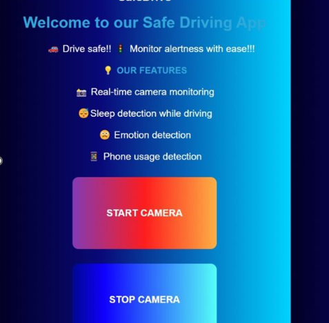
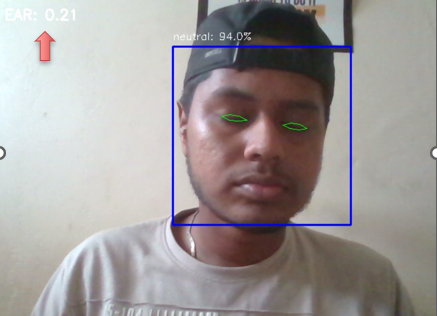
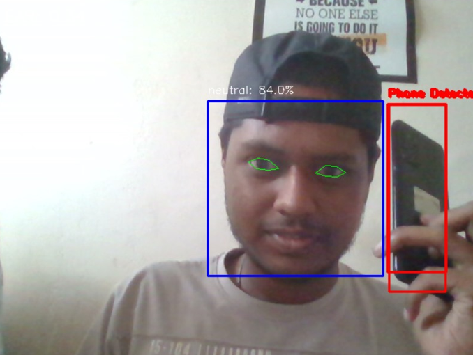
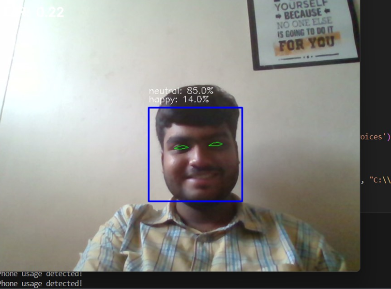

# 🚗 Safe Driving App

The **Safe Driving App** is designed to enhance road safety by continuously monitoring drivers for signs of drowsiness, emotional states, and phone usage. It provides real-time feedback and alerts to help drivers stay focused and alert on the road.

---

## 🌟 Features

- 💤 **Drowsiness Detection**  
  Monitors eye aspect ratio (EAR) to detect fatigue. Triggers an alert if drowsiness is detected.

- 🙂 **Emotion Detection**  
  Detects emotional states like happiness, anger, sadness, etc., using facial expression recognition.

- 📱 **Phone Usage Detection**  
  Uses a YOLO model to detect phone usage while driving and issues a warning.

---

## 🖼️ Screenshots

### 🧑‍💻 UI - Feature Overview


### 💤 Drowsiness Detection using EAR


### 📱 Phone Usage Detected


### 😀 Emotion Detection in Real-time


---

## 📁 Project Structure

| File | Description |
|------|-------------|
| `app.html` | Frontend HTML code |
| `emotional_detect.py` | Emotion detection module |
| `sleep_detection.py` | Drowsiness detection via EAR |
| `phone_detection.py` | Phone usage detection module |
| `single_code.py` | Integrated app combining all features |

---

## 🔍 Methodology

### 1. Real-time Video Frame Processing
- Uses Flask and OpenCV to capture and process frames.
- Integrates multiple detection modules in a single loop.

### 2. Models & Libraries Used
- **Dlib** for facial landmarks (EAR)
- **FER** for emotion detection
- **YOLOv4** for phone detection

### 3. Detection Logic

| Module | Metric | Condition |
|--------|--------|-----------|
| Drowsiness | EAR | Alert if EAR < 0.30 for 15 frames |
| Emotion | FER probabilities | Display if > 10% |
| Phone | YOLO | Detected if confidence > 50% |

---

## 📊 Sample Output

| Detection Module | Metric | Example Value |
|------------------|--------|----------------|
| Drowsiness Detection | EAR | 0.25 |
| Emotion Detection | Emotion Probs | [Happy: 0.70, Sad: 0.20] |
| Phone Detection | Boolean | True |

---

## 🛠️ Getting Started

```bash
git clone https://github.com/your-username/safe-driving-app.git
cd safe-driving-app
pip install -r requirements.txt
python single_code.py
```

Visit `http://localhost:5000` in your browser to use the app.

---

## 🚀 Future Enhancements

- Add driver-facing sensors (IR/blink rate, head pose).
- Use weather and traffic API data.
- Revamp the UI for mobile and dashboard views.

---

## 📜 License

This project is licensed under the MIT License. See `LICENSE` for details.

---

## ✨ Developed by Hrithik Kumaran K.G

If you found this helpful, leave a ⭐ on GitHub!
